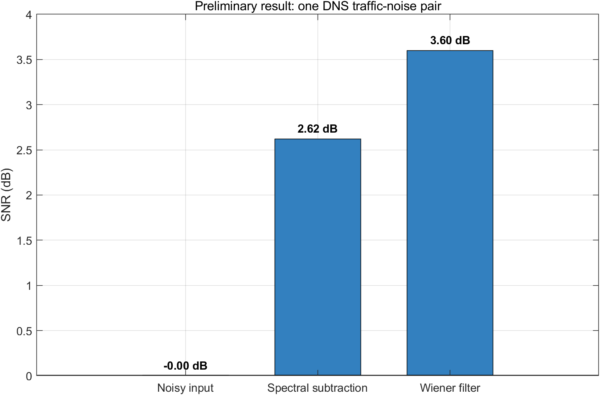
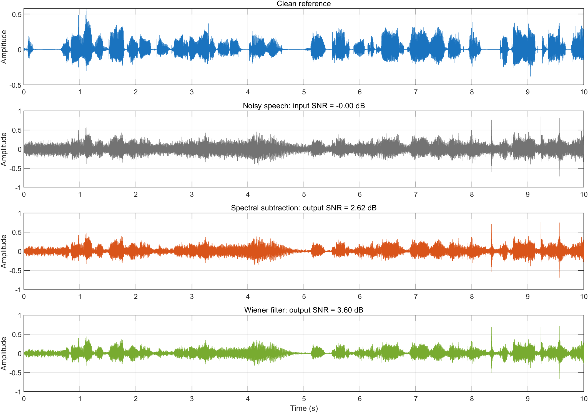
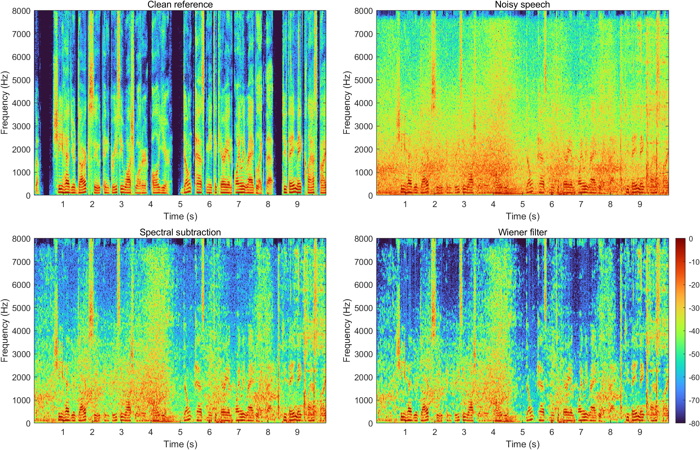

# Comparison of Wiener Filtering and Spectral Subtraction for Speech Noise Reduction

- **Course:** ELEC5305
- **Student:** Zhizhong Chen
- **Student ID:** 530668932
- **Project Status:** Preliminary Implementation — Project Feedback Two
- **Project Website:** https://czz0806.github.io/elec5305-project-530668932/

## Project Overview

Background noise can significantly reduce the clarity and intelligibility of recorded speech. This project investigates and compares two traditional speech-enhancement methods: Wiener filtering and spectral subtraction. Both methods are applied to noisy speech to evaluate their ability to reduce noise while preserving the original speech.

## Project Feedback Two: Progress Update

The first working MATLAB prototype has been completed. One official, time-aligned clean/noisy speech pair from the Microsoft DNS Challenge test set was used for this preliminary experiment. The recordings are 10 seconds long, mono, sampled at 16 kHz, and the noisy recording contains traffic noise at approximately 0 dB input SNR.

The current processing pipeline:

1. Loads and verifies the aligned clean and noisy recordings.
2. Computes a common STFT using a 32 ms Hamming window and 50% overlap.
3. Applies spectral subtraction and Wiener filtering independently.
4. Reconstructs both enhanced signals using inverse STFT and overlap-add.
5. Calculates SNR and saves enhanced audio, waveform, spectrogram and SNR comparisons.

The prototype uses the aligned clean reference to obtain a known noise reference for initial algorithm verification. Later experiments will replace this verification arrangement with practical noise estimation and will use more utterances, noise conditions and input SNRs.

### Preliminary Results

| Signal or method | Output SNR (dB) | SNR improvement (dB) |
| --- | ---: | ---: |
| Noisy input | 0.000 | 0.000 |
| Spectral subtraction | 2.622 | 2.622 |
| Wiener filtering | 3.597 | 3.597 |

Both methods improved SNR for this preliminary DNS traffic-noise example. Wiener filtering achieved the larger improvement, exceeding spectral subtraction by approximately 0.98 dB. This is only one test pair, so the result does not yet establish that one method is generally superior.

### Project Files

- [MATLAB preliminary prototype](code/run_feedback2.m)
- [Preliminary metrics](results/preliminary_metrics.csv)
- [Preliminary summary](results/preliminary_summary.txt)
- [Spectral-subtraction output audio](results/spectral_subtraction_output.wav)
- [Wiener-filter output audio](results/wiener_filter_output.wav)
- [Audio-source information](audio/SOURCE.txt)

## Project Objectives

- Use real speech and noise material from the Microsoft DNS Challenge dataset.
- Implement Wiener filtering for speech noise reduction.
- Implement spectral subtraction for speech noise reduction.
- Compare the two methods using objective measurements and visual analysis.
- Investigate the trade-off between noise reduction and speech distortion.

## Methodology

Audio files are converted to a common mono sampling format and checked for alignment before processing. Both enhancement methods use the same STFT configuration so that their results can be compared fairly. The enhanced signals are reconstructed using inverse STFT and overlap-add.

The preliminary experiment verifies the processing chain on one official aligned clean/noisy pair. The next stage will evaluate several utterances and environmental-noise conditions at controlled input SNR levels. The comparison will use SNR improvement, waveform and spectrogram inspection, additional error or quality measures where appropriate, and listening-based assessment.

## Data Source

The audio data comes from the official Microsoft DNS Challenge repository:

https://github.com/microsoft/DNS-Challenge

The preliminary pair was selected from the synthetic no-reverberation test set. Only a small subset is used to keep the project feasible.

## Current Limitations and Next Steps

The present numerical result is based on only one aligned traffic-noise example and therefore cannot support a general conclusion. The next steps are to:

- test multiple clean utterances, noise types and input SNR levels;
- introduce practical noise estimation rather than relying on a known reference noise signal;
- tune both algorithms under consistent conditions;
- compare average objective metrics across the test cases;
- document audible artefacts, including possible musical noise from spectral subtraction;
- update the project site with final tables, figures and conclusions.

## Software and Resources

- MATLAB R2024b
- Signal Processing Toolbox
- Audio Toolbox / Wavelet Toolbox where required
- GitHub Pages
- Microsoft DNS Challenge dataset

## Project Timeline

- **Weeks 1–3:** Background research and project planning — completed
- **Weeks 4–5:** Select and prepare DNS Challenge audio — completed for the preliminary pair
- **Weeks 6–7:** Implement and verify spectral subtraction — preliminary implementation completed
- **Weeks 8–9:** Implement and verify Wiener filtering — preliminary implementation completed
- **Weeks 10–11:** Expand experiments and compare results
- **Weeks 12–13:** Complete the final report and project website

## Preliminary References

1. Boll, S. F. (1979). Suppression of acoustic noise in speech using spectral subtraction. *IEEE Transactions on Acoustics, Speech, and Signal Processing, 27*(2), 113–120.
2. Loizou, P. C. (2013). *Speech Enhancement: Theory and Practice* (2nd ed.). CRC Press.
3. Dubey, H., et al. (2023). ICASSP 2023 Deep Noise Suppression Challenge. *IEEE International Conference on Acoustics, Speech and Signal Processing*.
4. Scalart, P., and Filho, J. V. (1996). Speech enhancement based on a priori signal-to-noise estimation. *Proceedings of the IEEE International Conference on Acoustics, Speech, and Signal Processing, 2*, 629–632. https://doi.org/10.1109/ICASSP.1996.543199

## Project Proposal

The full project proposal is available here: [Download the Project Proposal PDF](ELEC5305_Project_Proposal_Zhizhong_Chen.pdf).
